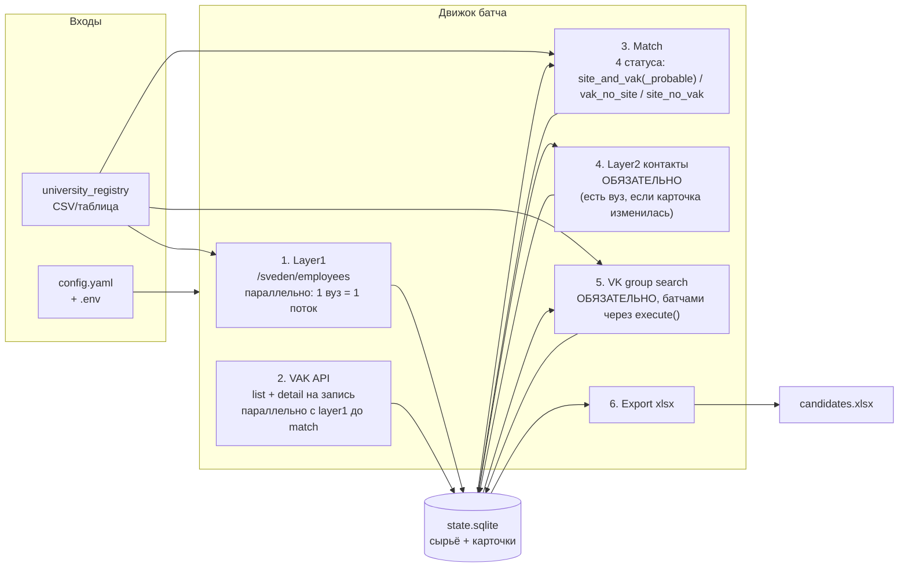

# Архитектура приложения (MVP)

Как собрать пайплайн из [candidate-pipeline-architecture.md](candidate-pipeline-architecture.md) в **запускаемую программу без UX/UI**: раз в месяц прогнали → через часы получили таблицу.

**Статус:** черновик под разработку  
**Продуктовые ограничения от заказчика:** UI не нужен; время прогона часы — ок; результат — файл (xlsx / аналог); **layer2 и VK — обязательные шаги** полного прогона (без согласия оператора на каждую карточку).

---

## 1. Форм-фактор: батч-CLI, не веб

| Делаем | Не делаем |
|---|---|
| Консольная команда / набор команд | Веб-админка, дашборд, «кнопка Искать в VK» в UI |
| Долгий прогон с логами в файл/консоль | Интерактивный UX, real-time прогресс в браузере |
| Итог: `output/candidates_YYYY-MM-DD.xlsx` | Онлайн-БД для заказчика, личный кабинет |
| Ручной разбор спорных строк **в Excel** | Отдельный UI проверяющего |

Проверяющий = человек, который открыл xlsx. Колонки `match_status`, `needs_review`, `vk_url` заменяют «экран карточки».

```text
оператор                    программа                         результат
────────                    ─────────                         ─────────
python -m app run ...  →    часы: парсинг / матч / VK  →   candidates.xlsx
                            (+ data/state.sqlite чекпоинты)
```

---

## 2. Высокоуровневая схема



Шаги **идемпотентны и с чекпоинтами**: упало на вузе №47 — после рестарта продолжаем с него, а не с нуля. Для месячного прогона на часы это обязательное требование, не «nice to have».

---

## 3. Стек (практичный минимум)

| Слой | Выбор | Зачем |
|---|---|---|
| Язык | **Python 3.12+** | HTTP, парсинг HTML, xlsx, скрипты — без лишней инфраструктуры |
| HTTP | `httpx` (+ опционально Playwright только для «упрямых» вузов) | ВАК JSON + сайты вузов |
| HTML слой 1 | `lxml` / selectolax по `itemprop` | Стандарт `/sveden/employees` |
| Состояние | **SQLite** (`data/state.sqlite`) | Чекпоинты, дедуп, повторный export без перепарса |
| Конфиг | `config.yaml` + `.env` | Список режимов, таймауты, пути; секреты (VK token) отдельно |
| Выгрузка | `openpyxl` → `.xlsx` | То, что заказчик открывает в Excel |
| Оркестрация | один пакет `app` + CLI (`typer` / `argparse`) | Без Airflow/K8s на MVP |
| Параллелизм | `ThreadPoolExecutor`: layer1 — по одному вузу на поток; layer1 и VAK — параллельно до match (порядок ingest не важен) | SQLite WAL + `busy_timeout`; один writer на upsert через connection per thread |

Сервер, Docker, очередь задач — **не нужны**, пока крутится на одной машине оператора. Docker можно добавить позже как «упаковали зависимости», не как архитектуру.

### 3.1. Retry/backoff — по каждому источнику, не только VK

Раньше это было продумано только для VK (см. `vk-matching-spec.md`, §8.1). Формализуем на все источники — единая обёртка HTTP-клиента (`httpx`), а не решение на месте в каждом модуле:

| Источник | Что лечим ретраем | Политика |
|---|---|---|
| ВАК API | list `/api/att/adverts/` + **detail** `/api/att/adverts/{id}/` на каждую запись; сеть/таймаут, 5xx | list — пагинация; detail — основной объём запросов. Таймаут 8–10 сек, до 3 повторов с backoff на сеть/5xx |
| Layer1 / Layer2 (сайты вузов) | сеть/таймаут, 5xx, временный 403 | до 3 повторов с backoff; постоянный 403 — не ретраим бесконечно, переключаемся на headless/прокси (механизм общий для слоя 1 и слоя 2, описан в `candidate-pipeline-architecture.md`, §6.3 — там просто исторически находится, привязки только к слою 2 нет), а после — в `university_errors` |
| VK API | код 6/9 (rate limit / flood control) | backoff 1с → 2с → 4с → 8с; код 5 (токен) — refresh, не ретрай |

Единая политика в одном месте (клиент-обёртка), а не разные `try/except` в каждом источнике — иначе за месяцы разработки поведение по источникам разъедется незаметно.

---

## 4. Модули кода (папки)

```text
app/
  cli.py                 # run / step / export / status / reset
  config.py
  pipeline/
    ingest.py            # layer1 и VAK параллельно до match
  registry/              # загрузка university_registry
  sources/
    vak/                 # клиент API ВАК, пагинация, is_pilot
    universities/
      layer1.py          # /sveden/employees → сырые сотрудники
      layer2.py          # discovery + контакты — обязательный шаг для карточек с вузом
  matching/              # нормализация ФИО, identity_key, 4 статуса site_and_vak/site_and_vak_probable/vak_no_site/site_no_vak, possible_namesakes
  vk/                    # MVP: users.search + group_id — обязательный шаг прогона
  export/
    xlsx.py              # листы Excel
  db/                    # схема SQLite, репозитории
data/
  university_registry.csv
  state.sqlite           # gitignore
  raw/                   # опционально кэш HTML/JSON ответов
output/
  candidates_*.xlsx
logs/
  run_*.log
```

Границы модулей = границы спек: ВАК, сайты, матчер, VK, export не протекают друг в друга через HTML — только через таблицы БД / DTO карточки.

---

## 5. Данные в SQLite (рабочая модель)

Не «продуктовая БД для пользователей», а **рабочий склад прогона**:

| Таблица | Содержание |
|---|---|
| `universities` | из registry: `official_name`, `aliases`, `domain`, `region`, `accreditation_status`, `vk_group_id`, `is_pilot`, `layer1_status` — те же поля, что в `university_registry` (см. `candidate-pipeline-architecture.md`, §3), таблица SQLite их не сокращает |
| `employees_raw` | сырой слой 1 (fio, post, degree, department, department_id, genExperience/specExperience, source_url, university_id) |
| `vak_raw` | сырые объявления ВАК (в т.ч. флаг `is_pilot`, из какой ветки пришла запись) |
| `candidates` | результат матча: единая карточка + `match_status` (закрытый список из 4: `site_and_vak`/`site_and_vak_probable`/`vak_no_site`/`site_no_vak`) + `needs_review` + `identity_key` + `candidate_content_hash` |
| `possible_namesakes` | связи «вероятный тёзка»: `site_candidate_id`, `vak_candidate_id`, `reason` — не статус карточки, а отдельная таблица (см. `candidate-pipeline-architecture.md`, §4.2.1) |
| `contacts` | email/phone из слоя 2 (если включён) |
| `vk_hits` | найденные профили (url, score, signals) |
| `runs` / `run_steps` | что уже сделано, ошибки по вузу/шагу; для инкрементальности — последняя успешно обработанная точка по каждому источнику (курсор ВАК, `university_site_hash` по вузу — хэш другой гранулярности, чем `candidate_content_hash` в `candidates`, не путать) |

После успешного матча `candidates` можно сколько угодно раз переэкспортить в xlsx без повторного обхода сети.

**Инкрементальность после первого прогона.** Первый `run` — всегда полный. Дальше движок по умолчанию выгружает только то, чего нет в базе: новые страницы ВАК (по курсору), изменившиеся сайты вузов (по `university_site_hash`), и не гоняет слой 2/VK повторно для карточек, которые не изменились с прошлого успешного прогона по `candidate_content_hash` (VK — исключение, его гоняем для всех подходящих карточек каждый раз, т.к. новый VK-профиль может появиться без изменений на нашей стороне). Подробности по источникам — `candidate-pipeline-architecture.md`, §8. Флаг `--full` в CLI форсирует полный пересбор.

---

## 6. CLI: как запускают

Идея — один «полный прогон» и возможность гонять шаги по отдельности (удобно при отладке и при «ВАК уже выгружен, сайты ещё нет»).

```bash
# месячный прогон (по умолчанию инкрементальный — см. §5; первый run всегда полный)
python -m app run --config config.yaml

# форсировать полный пересбор всех источников, а не только дельту
python -m app run --config config.yaml --full

# по шагам
python -m app step layer1
python -m app step vak
python -m app step match
python -m app step layer2      # обязателен в полном run (карточки с вузом)
python -m app step vk          # обязателен в полном run; токен в .env
python -m app export --out output/candidates.xlsx

python -m app status            # сколько вузов ок / ошибок, размер базы
python -m app reset             # явный полный сброс state.sqlite (см. §9 — перед этим авто-бэкап)
```

Флаги в `config.yaml` (пример смысла):

```yaml
run:
  layer1: true
  vak: true
  match: true
  layer2: true     # всегда в полном прогоне; только карточки с вузом
  vk: true         # всегда в полном прогоне; без согласия оператора

# VK_TOKEN обязателен в .env, иначе run падает на шаге vk
limits:
  request_delay_sec: 1.5
  layer1_workers: 4
  vak_request_delay_sec: 0.0
  vak_detail_workers: 8
  max_universities: null   # или 10 для пробного прогона
```---

## 7. Что в xlsx (контракт для заказчика)

Один файл, несколько листов:

**Лист `site_employees`** — сотрудники с сайтов вузов (`site_no_vak`, `site_and_vak`, `site_and_vak_probable`):

| Колонки | Откуда |
|---|---|
| full_name, match_status, needs_review | матчер |
| university, department, post, degree, academic_title | слой 1 |
| disciplines, gen_experience, spec_experience | слой 1 (`itemprop`) |
| email, phone, contact_url, vk_* | слой 2 / VK (пусто в MVP) |
| source_url | страница программы, откуда распарсили |

**Лист `vak_candidates`** — записи ВАК (`vak_no_site`, `site_and_vak`, `site_and_vak_probable`):

| Колонки | Откуда |
|---|---|
| branch, specialty_code, specialty_name, dissertation_type, topic | detail-карточка ВАK |
| defense_date, defend_org, council_cipher, org_address, org_phone, is_pilot | detail-карточка ВАK |

Слияния (`site_and_vak` / `site_and_vak_probable`) попадают **на оба листа**: site-колонки и VAK-колонки соответственно.

**Лист `candidates` (устарел)** — заменён двумя листами выше (MVP build `001-core-pipeline-mvp`).

**Лист `possible_namesakes`** (было `conflicts`) — пары «ВАК ↔ сайт» с одинаковым ФИО, но противоречащими сигналами, которые матчер не смержил автоматически. Это не 5-е значение `match_status` (обе карточки пары сохраняют свой обычный статус — `site_no_vak` и `vak_no_site` — и по-прежнему проходят слой 2/VK как любая другая карточка того же статуса), а отдельная связь-таблица только для этого листа и для `needs_review`. Подробности — `candidate-pipeline-architecture.md`, §4.2.1. Переименован специально: это не «конфликты данных», а гипотеза «вероятно, два разных человека».

**Лист `university_errors`** — вузы, где `/sveden/employees` не открылся / пустая вёрстка / таймаут (чтобы чинить registry, а не искать «куда делись люди»).

**Лист `run_meta`** — дата прогона, длительность, счётчики, git/version если есть.

Этого достаточно, чтобы «запустили → получили результат» без UI.

---

## 8. Порядок разработки (чтобы быстрее получить первую таблицу)

Не обязательно сразу весь пайплайн из спеки.

| Этап | Что работает | Артефакт |
|---|---|---|
| **M0** | registry (ручной CSV на 5–20 вузов) + layer1 + export | xlsx только сотрудники вузов |
| **M1** | + выгрузка ВАК + матчер (4 статуса: `site_and_vak` / `site_and_vak_probable` / `vak_no_site` / `site_no_vak`) | xlsx с двумя контурами людей |
| **M2** | + **layer2** (контакты с сайтов) для карточек с вузом | колонки email/phone |
| **M3** | + **VK пакетно** по `group_id` | колонки vk_url / vk_score / vk_status |

Полный месячный прогон для заказчика = **M3**: и layer2, и VK — обязательные шаги (не флаги «можно выключить»). Layer2 не для `vak_no_site` (нет домена работодателя); VK — для всех с `vk_group_id`.

**Оценка времени прогона, посчитанная по шагам (порядок величины для ~100 тыс. преподавателей в стране):**

| Шаг | Ограничение | Расчёт |
|---|---|---|
| ВАК, полная выгрузка (первый прогон) | сервер отвечает 3–5 сек/запрос, без объявленного rate limit | 164 045 записей / pageSize=100 ≈ 1640 страниц; при 5–10 параллельных запросах — десятки минут, не часы. Инкрементально (после 1-го прогона) — минуты, если API поддерживает выборку по дате/сортировке (см. §5 в `candidate-pipeline-architecture.md`, нужно проверить технически) |
| Layer1, обход сайтов вузов | вежливая задержка 1–2 сек **к одному домену**, но домены независимы | при ~10 параллельных доменах и сотнях вузов — часы на первый полный обход, минуты на инкрементальный (только изменившиеся) |
| Layer2, контакты | десятки страниц на кандидата, зависит от того, протоптан ли маршрут по вузу (§6.4 в `candidate-pipeline-architecture.md`) | самый непредсказуемый шаг по времени — вне контроля этой спеки (разрабатывает другой человек) |
| VK, батч-поиск | **уточнено:** 3 запроса/сек на пользовательский токен (подтверждено на dev.vk.com), но метод `execute` бандлит до 25 вызовов `users.search` в один запрос → реальная пропускная способность ≈ 3×25 = **75 запросов/сек** на токен, а не 3/сек буквально | 100 000 кандидатов / 75 в сек ≈ **22 минуты** теоретически. Есть неподтверждённый документами скрытый антиспам-лимит (~25–40 вызовов за окно, см. `vk-matching-spec.md`, §8.1) — **нужно проверить эмпирически на реальном токене**, тратит он лимит по «сырым» вызовам внутри `execute` или по самим `execute`-запросам; от этого зависит, держится ли расчёт на практике |

Итог: если реализовать параллелизм слоя 1/2 и батчинг VK через `execute`, полный прогон на всю страну вероятно укладывается в **часы**, а не в «часы-сутки» — но это нужно подтвердить на реальных данных, а не только расчётом.

---

## 9. Операционка

- Запуск: ноут/ВМ оператора, интернет, Python venv.
- Секреты: `.env` (`VK_TOKEN=...`), не в git.
- Логи: один файл на run + ошибки по `university_id` в SQLite.
- Повтор: `run` продолжает с чекпоинта; полный сброс — отдельная команда `app reset` (явная, чтобы не стереть случайно).
- **Бэкапы (save-points):** перед `app reset` и после каждого успешно завершённого `run` — автоматическая копия `data/state.sqlite` в `data/backups/state_<run_id>.sqlite` (ротация — хранить последние N, например 6 последних прогонов). Дешёвая страховка от «нажали reset не подумав» или «прогон сломался на середине export».
- Юридически/вежливо: delay между запросами, уважение `robots.txt` где уместно; `/sveden/` — публичная обязанность вуза.

---

## 10. Что сознательно выкинули из «классического продукта»

- UI проверяющего и кнопка «Искать в VK» → VK идёт сам в прогоне; в Excel только результат (ссылка/скор).
- **Возврат решений проверяющего в базу.** Оператор открывает xlsx и делает с ним что хочет — программа не ждёт от него никакого ответа/фидбека обратно в `state.sqlite`. Каждый прогон матчер и VK считают карточки заново по тем же правилам; это осознанный выбор, не забытая доработка.
- **История кандидата между прогонами.** Не храним, зачем не нужно версионировать одну и ту же карточку по месяцам — только `candidate_content_hash`/`university_site_hash`/курсоры для инкрементальности (§5), не для отчётности «что изменилось у Иванова с прошлого раза».
- Онлайн-синхронизация, мультитенант, роли пользователей.
- Оркестраторы (Airflow), микросервисы, отдельная Postgres.
- Широкий VK без `group_id` (вне MVP VK-спеки); согласие оператора на каждую карточку.

Если позже понадобится «чуть удобнее» — максимум тонкая обёртка (скрипт + Task Scheduler / cron раз в месяц), не переписывание в веб.

---

## Связанные документы

- Логика данных: [candidate-pipeline-architecture.md](candidate-pipeline-architecture.md)
- ВАК: [../BAK/vak-analysis.md](../BAK/vak-analysis.md)
- Сайты вузов: [../sites_uniks/university-sites-analysis.md](../sites_uniks/university-sites-analysis.md)
- VK MVP: [../vk/vk-matching-spec.md](../vk/vk-matching-spec.md)
