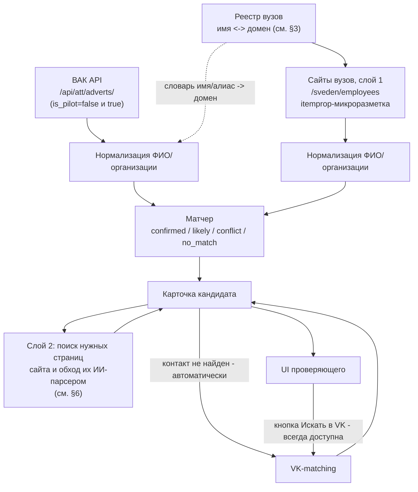

# Пайплайн: объединение источников в карточку кандидата

Архитектура сборки единой карточки кандидата из ВАК и слоя 1 сайтов вузов (`/sveden/employees`), с последующим поиском нужных страниц сайта вуза и обходом их ИИ-парсером (слой 2) и опциональным поиском в ВК.

**Статус:** черновик спеки для разработки
**Связанные документы:** [vak-analysis.md](../BAK/vak-analysis.md), [university-sites-analysis.md](../sites_uniks/university-sites-analysis.md), [vk-matching-spec.md](../vk/vk-matching-spec.md)

---

## 1. Зачем сшивать ВАК и сайты вузов

Источники закрывают дыры друг друга:

| | Даёт | Не даёт |
|---|---|---|
| Сайт вуза, слой 1 (`/sveden/employees`) | текущее место работы, степень, дисциплины | дату защиты (нет в обязательном разделе) |
| ВАК | точную дату защиты, специальность, тип диссертации | текущее место работы/контакт (только организация защиты, не факт что текущий работодатель) |

Без сшивки запись ВАК — тупиковый лид: нет пути к контакту, кроме прямого запуска VK-поиска по одному ФИО. Со сшивкой — карточка с работодателем, дисциплиной и явным контактным путём (слой 2 → или VK).

---

## 2. Схема пайплайна



---

## 3. Реестр вузов: чем закрываем открытый вопрос

Официальный источник — реестр Рособрнадзора «Организации, осуществляющие образовательную деятельность по аккредитованным образовательным программам» (открытые данные на `obrnadzor.gov.ru/otkrytoe-pravitelstvo/opendata/`). Он даёт легитимный список аккредитованных организаций (полное название, ИНН, ОГРН, статус), но **не содержит поле «сайт вуза»** — это подтверждается и структурой стороннего зеркала этого реестра (поля `EduOrgINN`, `EduOrgOGRN`, `EduOrgFullName` — домена нет).

**Вывод:** реестр закрывает вопрос «какие вузы вообще аккредитованы и как называются официально», но не даёт домен для похода на `<домен>/sveden/employees` — домен нужно резолвить отдельным шагом:

1. Взять официальные названия из реестра Рособрнадзора (источник правды по факту аккредитации).
2. Сопоставить название → домен через один из практических путей: открытые каталоги вузов (`edu.ru`, `russia.edu.ru`), общедоступные агрегированные базы (например, community-проекты на GitHub, которые уже держат поле `website` рядом с названием/регионом), либо автоматический веб-поиск `"<полное название вуза>" сайт` с последующей проверкой.
3. **Обязательная валидация** каждого резолвнутого домена: реальный запрос на `<домен>/sveden/employees` должен вернуть 200 и страницу с ожидаемой структурой (см. `university-sites-analysis.md`, §3) — если нет, домен считается неразрешённым, а не мёртвым источником (не выбрасываем вуз, ставим в очередь на ручной разбор).

Результат этого шага — таблица `university_registry`: `official_name, aliases[], domain, region, accreditation_status`. Она пригодится не только здесь, но и в [vk-matching-spec.md](../vk/vk-matching-spec.md) (§2, справочник `university_name → vk_group_id`) — имеет смысл вести её **в одном месте**, а не дублировать словарь вузов в двух командах.

---

## 4. Матчер: сшивка ВАК и слоя 1

### 4.1. Нормализация перед сравнением

**ФИО:** привести к единому регистру, `ё → е`, схлопнуть повторные пробелы, убрать пробелы вокруг дефисов в двойных фамилиях (`Петров-Водкин`, не `Петров - Водкин`). Сравнение строгое посимвольное после нормализации — **без** перестановки токенов (не считаем совпадением разный порядок частей ФИО, это источник ложных срабатываний на homonym-риске, а не защита от него).

**Организация:** сравниваем `defend_org` (ВАК) с `official_name`/`aliases` вуза из реестра (§3) через fuzzy-сравнение строк (учитывает сокращения — «УрФУ» ≈ «Уральский федеральный университет им. первого Президента России Б.Н. Ельцина»).

### 4.2. Уровни матча

| Уровень | Условие | Действие |
|---|---|---|
| `confirmed` | ФИО совпало **и** организация ВАК ≈ вуз сайта (по словарю алиасов) | авто-слияние, высокая уверенность |
| `likely` | ФИО совпало, организация другая, но нет противоречий по степени/специальности | слияние с пометкой «возможно, сменил место работы после защиты» |
| `conflict` | ФИО совпало, но сигналы противоречат: сайт указывает **более низкую** степень, чем следует из ВАК-записи (например, ВАК — докторская защита, а на сайте до сих пор «кандидат наук»), **или** специальность ВАК и дисциплины сайта — из полностью не связанных областей | **не сливаем автоматически** — показываем обе карточки рядом с пометкой «проверить вручную, вероятный тёзка», решение за проверяющим |
| `no_match` | ФИО не найдено во втором источнике | карточка остаётся самостоятельной (`vak_only` / `site_only`), не блокируем выдачу |

Важно: `conflict` — это **мягкий флаг для проверяющего, а не отбрасывание данных** — не решаем за человека, просто показываем сигналы. Обратный случай — сайт показывает **более высокую** степень, чем ВАК-запись (кандидатская в ВАК, «доктор наук» на сайте) — это **не конфликт**: человек мог защитить докторскую позже, и в базе ВАК просто может быть отдельная более поздняя запись на то же ФИО. Один сайт-профиль может быть связан с **несколькими** записями ВАК (кандидатская, затем докторская) — матчер должен поддерживать one-to-many, а не заставлять выбирать одну запись.

### 4.3. Примеры

**`confirmed`:** ВАК: `fio="Иванов Алексей Петрович"`, `defend_org="Уральский федеральный университет им. первого Президента России Б.Н. Ельцина"`, `dissertation_type="Кандидатская"`. Сайт (`urfu.ru/sveden/employees`): `fio="Иванов Алексей Петрович"`, `degree="кандидат технических наук"`. ФИО совпало, организация совпала через алиас, степень согласуется → `confirmed`.

**`likely`:** ВАК: `fio="Смирнова Ольга Викторовна"`, `defend_org="Новосибирский государственный университет"`, `dissertation_type="Докторская"`. Сайт (`utmn.ru`): `fio="Смирнова Ольга Викторовна"`, `degree="доктор экономических наук"`. ФИО совпало, организация другая (НГУ vs ТюмГУ), но степень согласуется (докторская/доктор) → `likely`, «возможно, переехала из Новосибирска в Тюмень после защиты».

**`conflict`:** ВАК: `fio="Кузнецов Дмитрий Сергеевич"`, `dissertation_type="Докторская"`, `specialty="Ветеринария"`. Сайт (`spbu.ru`): `fio="Кузнецов Дмитрий Сергеевич"`, `degree="кандидат наук"`, `disciplines=["Информатика", "Программирование"]`. Степень на сайте ниже, чем следует из ВАК-записи, и область совсем другая → `conflict`, вероятны два разных человека с одинаковым ФИО — не сливаем, показываем отдельно с пометкой.

---

## 5. Единая карточка кандидата

| Поле | Источник | Комментарий |
|---|---|---|
| `candidate_id` | генерируется | суррогатный ключ |
| `full_name` (+ normalized) | ВАК / сайт вуза | ключ сшивки |
| `match_status` | матчер | `confirmed` / `likely` / `conflict` / `vak_only` / `site_only` |
| `university`, `department` | сайт вуза (слой 1) | текущий работодатель |
| `degree`, `academic_title`, `disciplines` | сайт вуза (слой 1) | |
| `defenses[]` (`date`, `specialty_code`, `dissertation_type`, `topic`) | ВАК | массив — один человек может иметь несколько записей защит |
| `email`, `phone`, `contact_type`, `contact_source_url` | слой 2 (поиск страниц + ИИ-парсер) | добавляется отдельным процессом, см. §6 |
| `vk_candidates[]` | VK-matching, по требованию | заполняется только после ручного запуска |
| `_provenance` | все | какое поле из какого источника — для отладки и доверия |

---

## 6. Слой 2: поиск нужных страниц сайта и обход их ИИ-парсером

Разрабатывает другой человек. Чтобы не блокировать друг друга, фиксируем контракт на входе/выходе (§6.6) — а здесь описываем саму механику, чтобы она была общим пониманием, а не «чёрным ящиком».

### 6.1. Два модуля, а не один «ИИ-парсер на всё»

Задача делится на разные по сложности и стоимости части:

| Модуль | Что делает | LLM нужна? |
|---|---|---|
| **Discovery** (поиск страницы) | Найти на сайте вуза конкретную страницу с контактами нужного подразделения | Нет — обычный краулер + правила |
| **Extraction** (снятие контакта) | Вытащить email/телефон со страницы, привязать к правильному человеку | Нет для типового случая (regex + контекст рядом с ФИО); да — для нестандартной вёрстки или спорных случаев |

Самое дорогое и медленное — не извлечение контакта (обычно достаточно regex), а именно **поиск нужной страницы**, потому что структура сайтов вузов не стандартизирована (в отличие от `/sveden/employees`).

### 6.2. Discovery: как ищем нужную страницу, не наугад

У нас уже есть якоря из слоя 1 — ФИО и название подразделения (кафедра/институт), поэтому задача не «прочесать весь сайт», а «найти страницу конкретного подразделения»:

```text
Шаг 1 — полная структура вуза (без LLM):
  открыть <домен>/sveden/struct
  это тот же обязательный раздел (Приказ №1493), что и /sveden/employees —
  даёт полный список институтов/факультетов/кафедр вуза как факт закона,
  а не предположение

Шаг 2 — сматчить нужное подразделение (без LLM):
  fuzzy-сравнение department из карточки с названиями из /sveden/struct
  ("ИРИТ-РТФ" ≈ "Институт радиоэлектроники и информационных технологий")

Шаг 3 — найти страницу подразделения (краулер, без LLM):
  приоритет: <домен>/sitemap.xml → искать URL с нужным подразделением
  fallback: обход по ссылкам с /sveden/struct и с главной страницы
  fallback: site:<домен> "<название подразделения>" контакты (поисковик)

Шаг 4 — извлечь контакт (без LLM):
  regex по email/телефонам на найденной странице
  проверить контекст: стоит ли рядом ФИО кандидата
  → contact_type = personal (высокая уверенность)
  если рядом ФИО нет, но есть кафедра/институт → contact_type = department/institute

Шаг 5 — LLM, только если застряли:
  /sveden/struct пустой или без ссылок на подразделения
  fuzzy-матч department дал несколько похожих вариантов, не ясно какой
  на странице несколько ФИО и несколько email — неясно, что к чему
```

Если кафедр в вузе формально нет (структура по институтам/школам без кафедр — бывает) — шаг 2 просто матчит на уровень института, отдельной обработки не требуется.

### 6.3. Краулер: скорость и ограничения

Краулер — программа, которая идёт по ссылкам сайта, как человек кликал бы мышкой, только автоматически (очередь URL → скачать → найти ссылки → добавить в очередь). Здесь он **не обходит весь сайт**, а идёт целенаправленно к найденному подразделению, поэтому по факту — десятки страниц, не тысячи.

**Приоритизация ссылок** (что повышает/понижает очередь на обход):

| Повышаем приоритет | Понижаем приоритет |
|---|---|
| контакты, сотрудники, преподаватели, кафедра, состав кафедры | новости, абитуриентам, расписание, документы |
| staff, teachers, persons, people | вакансии, оплата обучения, олимпиады |

**Ограничения, чтобы не застрять:**

| Ограничение | Значение | Зачем |
|---|---|---|
| Задержка между запросами к одному домену | 1–2 сек | вежливость, не DDOS-ить сервер вуза |
| Max depth (глубина от старта) | 4–5 | не уходить далеко от найденного подразделения |
| Max pages per domain на одного кандидата | 500–1000 | защита от «crawl trap» (бесконечные календари/фильтры) |
| Нормализация URL перед проверкой «уже посещён» | обязательно | одна и та же страница часто доступна по 3–5 разным адресам |
| `robots.txt` | уважаем | кроме `/sveden/`, который законодательно обязан быть публичным |

**Когда обычный HTTP-запрос не работает:** сайт отдаёт 403 (антибот-защита) или пустой HTML (JS-рендеринг, SPA) → переключаемся на headless-браузер **только для этого конкретного вуза**, не для всех — это в 5–10 раз дороже и медленнее обычного запроса.

### 6.4. Кэш правил по вузу — чтобы не обходить сайт каждый раз

Первый кандидат из вуза — дорогой проход (discovery + возможно LLM). По его результату сохраняем правило: «на этом вузе контакты кафедр лежат по паттерну `<домен>/<институт>/kontakty/`» (или другой найденный паттерн). Для следующих кандидатов **того же вуза** сначала пробуем это правило (дёшево), и только если оно не сработало (сайт поменялся) — снова идём в полный discovery.

### 6.5. Уровни уверенности контакта

Раз корпоративный контакт/телефон тоже подходит (не обязательно личный email), фиксируем 4 уровня вместо бинарного «нашли/не нашли»:

| `contact_type` | Что это | `confidence` |
|---|---|---|
| `personal` | email/телефон стоит рядом с точным ФИО кандидата | `high` |
| `department` | общий email кафедры/заведующего кафедрой (личный не нашли) | `medium` |
| `institute` | общий email института/факультета | `low` |
| `none` | страницу подразделения нашли, но контакта на ней нет | `low` (не путать с «страницу не нашли вообще» — см. `crawl_status` в контракте) |

### 6.6. Контракт (вход/выход)

**Вход** — кандидаты, у которых уже есть работодатель из слоя 1:

```json
{
  "candidate_id": "c_00123",
  "full_name": "Иванов Алексей Петрович",
  "university_domain": "urfu.ru",
  "department": "Институт радиоэлектроники и информационных технологий"
}
```

**Выход** — сливается обратно в карточку по `candidate_id`:

```json
{
  "candidate_id": "c_00123",
  "crawl_status": "page_found",
  "contact_type": "personal",
  "email": "a.p.ivanov@urfu.ru",
  "phone": null,
  "source_url": "https://urfu.ru/.../staff/persons/ivanov-ap",
  "confidence": "high"
}
```

`crawl_status` отделяет два разных типа неудачи — они по-разному чинятся: `page_not_found` (даже подразделение/страница не нашлись — проблема в discovery, возможно, нужно пересмотреть правило по вузу) и `page_found` (страница нашлась, `contact_type` может быть вплоть до `none` — проблема в том, что на странице просто нет контактов).

Парсеру не нужно ничего знать про ВАК или про матчер — он получает список «кого искать в каком вузе» и возвращает контакты по `candidate_id`.

---

## 7. Интеграция VK (по требованию, не пакетно)

VK не гоняем по всей базе. Два триггера на одну и ту же карточку:

1. **Автоматический fallback:** слой 2 отработал и не нашёл ни email, ни телефон → карточка сама уходит в VK-matching, без участия человека.
2. **Ручная кнопка «Искать в VK»:** доступна на карточке всегда, независимо от результата слоя 2 — админ может запросить VK-профиль как доп. канал, даже если email уже есть.

В обоих случаях источник входных данных один и тот же: если карточка `confirmed`/`likely`, в VK-matching передаются не только ФИО, а ещё `university` (для `group_id`) и возраст, оценённый из `defense_date` — точнее, чем стандартная оценка «по стажу» в VK-спеке. Детали — в [vk-matching-spec.md](../vk/vk-matching-spec.md), §6 «Фаза 0».

---
