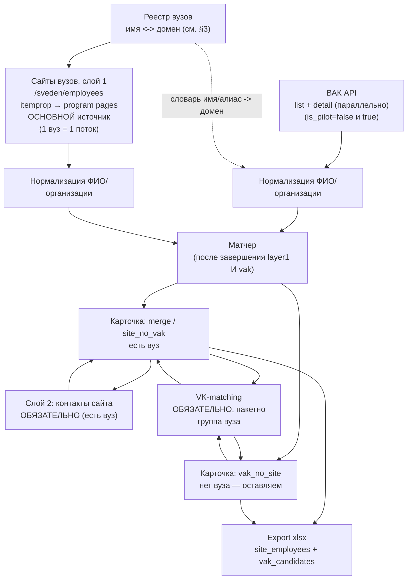

# Пайплайн: объединение источников в карточку кандидата

Архитектура сборки единой карточки кандидата из **основного** источника — слоя 1 сайтов вузов (`/sveden/employees`) — и **дополнительного** источника ВАК: слияние при совпадении человека, сохранение `vak_no_site` если человека нет на сайтах вузов. Дальше — поиск нужных страниц сайта вуза и обход их ИИ-парсером (слой 2, только для карточек с вузом) и **обязательный** поиск в ВК (без согласия оператора на каждую карточку).

**Статус:** **M1 реализован** в коде (`001-core-pipeline-mvp`); layer2/VK — контракт зафиксирован, реализация — M2/M3.  
**Эмпирика smoke5:** ingest wall-clock ≈ max(layer1, vak) ≈ 4 мин; 0 merge между site и VAK на первых 5 вузах реестра (2 без domain).
**Связанные документы:** [vak-analysis.md](../BAK/vak-analysis.md), [university-sites-analysis.md](../sites_uniks/university-sites-analysis.md), [vk-matching-spec.md](../vk/vk-matching-spec.md), [app-architecture.md](app-architecture.md)

---

## 1. Модель данных: вузы — основа, ВАК — дополнение (не полный merge)

**Договорённость с заказчиком:** сайты вузов остаются основной частью базы (то, что вузы обязаны публиковать по закону). С ВАК мы **не** делаем «слить всё в одну кучу». Правило такое:

| Ситуация | Что делаем |
|---|---|
| Один и тот же человек есть и в ВАК, и на сайте вуза | **мержим** записи в одну карточку |
| Человек есть только в ВАК (на сайтах вузов нет) | **оставляем** карточку `vak_no_site` — не отбрасываем |
| Человек есть только на сайте вуза (в ВАК нет) | карточка `site_no_vak` — это **самый частый случай, не исключение**: у большинства преподавателей просто нет записи в ВАК (не защищались недавно / защита не попала в выгрузку), это не повод считать данные проблемными |

> **Про названия статусов.** Раньше здесь использовались термины `confirmed` / `conflict` — они звучат так, будто расхождение источников — это ошибка. На практике «нет в ВАК» — нормальное состояние большинства карточек, а не сбой. Ниже везде используется нейтральная схема названий (см. §4.2).

В итоге в собранной базе два осмысленных контура людей:

1. **Работают в вузах** — пришли из `/sveden/employees` (с обогащением из ВАК, если матч нашёлся).
2. **В вузах сейчас не числятся**, но по ВАК видно, что они уже кандидаты / доктора или метят в защиту (объявление о защите) — пришли как `vak_no_site`.

Источники по-прежнему закрывают дыры друг друга, но приоритет ясный: вуз = работодатель и контактный путь; ВАК = факт/план защиты и расширение охвата за пределы штата вузов.

| | Даёт | Не даёт |
|---|---|---|
| Сайт вуза, слой 1 (`/sveden/employees`) | текущее место работы, степень, дисциплины | дату защиты (нет в обязательном разделе) |
| ВАК | точную дату защиты, специальность, тип диссертации; людей вне штата вузов | текущее место работы/контакт (только организация защиты, не факт что текущий работодатель) |

Сшитая карточка (`site_and_vak` / `site_and_vak_probable`) даёт работодателя + защиту + **обязательный** путь к контакту: слой 2 (сайт вуза) и VK по группе вуза. Карточка `vak_no_site` — лид без вуза: слой 2 не запускаем (нет домена); VK — если `defend_org` смапился на вуз с `vk_group_id`.

---

## 2. Схема пайплайна



---

## 2.1. Оркестрация ingest (реализовано)

До шага **match** порядок layer1 и VAK не важен — `app/pipeline/ingest.py` гоняет их **параллельно**:

| Поток | Поведение | Конфиг |
|---|---|---|
| Layer1 | индекс `/sveden/employees` → ссылки на program pages → `itemprop` parse; **не** ходим на `/sveden/struct/` как на источник ППС; дедуп по ФИО+вуз (`employee_merge.py`) | `layer1_workers`, `request_delay_sec` |
| VAK | list `/api/att/adverts/` (последовательно, чекпоинт) → detail `/api/att/adverts/{id}/` **параллельно** на страницу | `vak_detail_workers`, `vak_max_pages` |

Wall-clock ingest ≈ **max(время layer1, время VAK)**, не сумма. SQLite: WAL + `busy_timeout`, connection per thread.

### Layer1: какие поля с сайта

Парсим `itemprop` с program-страниц: `fio`, `post`, `degree`, `academStat`, `teachingDiscipline`, `genExperience`, `specExperience`, `teachingLevel`, `employeeQualification`, `profDevelopment`, `teachingOp`.

**Эмпирика smoke5:** `specExperience` заполнен у ~95% записей; `genExperience` часто **пуст** (вуз не ставит разметку, хотя по Приказу №1493 оба поля обязательны — см. `university-sites-analysis.md`, §5). В xlsx обе колонки есть; для анализа надёжнее `spec_experience`.

### VAK: list vs detail

List-эндпоинт отдаёт только `fio`, `dissertation_name`, `date_defend`. Поля `specialty`, `branch`, `defend_org`, `council_cipher`, `org_address`, `org_phone` — только из **detail-карточки** (см. `vak-analysis.md`).

---

## 3. Реестр вузов: чем закрываем открытый вопрос

Официальный источник — реестр Рособрнадзора «Организации, осуществляющие образовательную деятельность по аккредитованным образовательным программам» (открытые данные на `obrnadzor.gov.ru/otkrytoe-pravitelstvo/opendata/`). Он даёт легитимный список аккредитованных организаций (полное название, ИНН, ОГРН, статус), но **не содержит поле «сайт вуза»** — это подтверждается и структурой стороннего зеркала этого реестра (поля `EduOrgINN`, `EduOrgOGRN`, `EduOrgFullName` — домена нет).

**Вывод:** реестр закрывает вопрос «какие вузы вообще аккредитованы и как называются официально», но не даёт домен для похода на `<домен>/sveden/employees` — домен нужно резолвить отдельным шагом:

1. Взять официальные названия из реестра Рособрнадзора (источник правды по факту аккредитации).
2. Сопоставить название → домен через один из практических путей: открытые каталоги вузов (`edu.ru`, `russia.edu.ru`), общедоступные агрегированные базы (например, community-проекты на GitHub, которые уже держат поле `website` рядом с названием/регионом), либо автоматический веб-поиск `"<полное название вуза>" сайт` с последующей проверкой.
3. **Обязательная валидация** каждого резолвнутого домена: реальный запрос на `<домен>/sveden/employees` должен вернуть 200 и страницу с ожидаемой структурой (см. `university-sites-analysis.md`, §3) — если нет, домен считается неразрешённым, а не мёртвым источником (не выбрасываем вуз, ставим в очередь на ручной разбор).

Результат этого шага — таблица `university_registry`: `official_name, aliases[], domain, region, accreditation_status, vk_group_id, is_pilot`. Она нужна и сайтам вузов, и [vk-matching-spec.md](../vk/vk-matching-spec.md) (MVP ищет только в группе вуза) — вести **в одном месте**.

`is_pilot` — булев флаг «вуз имеет право самостоятельного присуждения степеней» (см. `vak-analysis.md`, §2: МГУ, СПбГУ и ~25 нацисследовательских/федеральных вузов). Для таких вузов при выгрузке ВАК обязательно запрашиваем **обе** ветки (`is_pilot=false` и `is_pilot=true`) при матчинге — иначе часть защит таких вузов не найдётся, хотя запись физически существует в базе ВАК.

**Ведение реестра.** Реестр (домены + `vk_group_id`) поддерживается **вручную** в `data/university_registry.csv`. Рособрнадзор даёт название/ИНН, но **не домен** — колонка `domain` часто пустая; без неё layer1 ставит `unresolved_domain` и **не делает HTTP** (это не «сайт недоступен»). Пример smoke5: `uni_0002` (Донецкая академия транспорта → `dat-dn.ru`), `uni_0003` (МГИМО-МЕД → `med.mgimo.ru`) — сайты живые, домены просто не прописаны.

Механизм отлова: лист `university_errors` в xlsx + `python -m app status`.

---

## 4. Матчер: когда мержим, когда оставляем отдельно

Матчер отвечает на один вопрос: **это один и тот же человек в обоих источниках?** Если да — merge. Если нет — обе стороны живут как самостоятельные карточки (в т.ч. `vak_no_site` **намеренно** остаётся в базе — это не «мусор матча», а отдельный контур лидов).

### 4.1. Нормализация перед сравнением

**ФИО:** привести к единому регистру, `ё → е`, схлопнуть повторные пробелы, убрать пробелы вокруг дефисов в двойных фамилиях (`Петров-Водкин`, не `Петров - Водкин`). Сравнение строгое посимвольное после нормализации — **без** перестановки токенов (не считаем совпадением разный порядок частей ФИО, это источник ложных срабатываний на homonym-риске, а не защита от него).

**Организация:** сравниваем `defend_org` (ВАК) с `official_name`/`aliases` вуза из реестра (§3) через fuzzy-сравнение строк (учитывает сокращения — «УрФУ» ≈ «Уральский федеральный университет им. первого Президента России Б.Н. Ельцина»).

### 4.1.1. Ключ идентичности для тех, кто устроен в вузе (без даты рождения)

Дату/год рождения источники **почти никогда** не дают (ни ВАК, ни `/sveden/employees` — см. `vak-analysis.md` и `university-sites-analysis.md`), поэтому на неё как на анти-однофамильный сигнал рассчитывать не приходится. Вместо неё для карточек, у которых есть запись сайта вуза, используем то, что реально есть в `itemprop`-разметке слоя 1:

```
identity_key = normalized_fio + university_id + department_id + genExperience/specExperience (стаж)
```

**`department_id` — канонический, не «fuzzy на лету».** Fuzzy-сравнение — это способ **один раз** сопоставить название подразделения с канонической записью `/sveden/struct` (см. §6.2, шаг 2) и получить стабильный `department_id`; но само fuzzy-сравнение — не детерминированная функция (версия алгоритма/словаря синонимов может измениться между прогонами и дать другой результат для того же текста). Поэтому в `identity_key` кладём уже резолвнутый `department_id`, а не результат сравнения строк на каждый прогон — иначе ключ «плывёт» и ломает и дедуп, и инкрементальность (§8).

Зачем именно так:

- **Дедуп внутри одного вуза.** Один преподаватель обычно фигурирует на `/sveden/employees` в нескольких образовательных программах сразу (см. `university-sites-analysis.md`, §2) — это создаёт повторы одной и той же записи. Схлопываем по `fio_normalized + university_id` (+ `department_id`, если есть), объединяя `disciplines` и беря непустые поля; **не** ходим на `/sveden/struct/` как на источник ППС (там только ФИО/должность без стажа). Стаж (`genExperience`/`specExperience`) — свойство человека; если у двух строк одно ФИО в одном вузе, но стаж расходится больше чем на ±2 года — оставляем две строки (защита от однофамильцев).
- **Анти-однофамильный сигнал внутри вуза.** Если в одном вузе (или на одной кафедре) встретились два человека с одинаковым ФИО, но разным стажем/подразделением — это сигнал, что это два разных человека, а не дубль.
- **Ключ стабильности между прогонами.** Раз нет внешнего уникального ID (СНИЛС/ORCID недоступны), именно `identity_key` — то, чем мы узнаём «это тот же кандидат, что и в прошлом месяце» для инкрементальных прогонов (см. §8). Стаж за год увеличивается на ~1 — это ожидаемо и не должно расцениваться как «новый человек»: сравнение стажа между прогонами делаем с допуском ±1–2 года, а не строгим равенством.

Это дополнительный, а не заменяющий сигнал: связка с ВАК всё равно идёт по ФИО + организация (§4.1), `identity_key` работает *до* него (дедуп слоя 1) и *после* него (стабильность карточки между прогонами).

**Что делаем с полем `disciplines` при схлопывании дублей.** Раз несколько сырых строк по одному `identity_key` (разные образовательные программы) склеиваются в одну карточку, `disciplines` этой карточки — это **объединение** (union) списков `teachingDiscipline` из всех схлопнутых строк с точным (посимвольным) удалением повторов. Это не «чистка» и не фаззи-нормализация, а обязательная часть самого слияния — иначе в одной карточке одна и та же дисциплина будет продублирована по числу программ, в которых человек участвует. Дальше — то, что можно, но не обязательно на MVP: **фаззи-группировка** похожих, но не идентичных названий (`"Информатика"` vs `"Информатика и ИКТ"`) в общую таксономию дисциплин. Это осознанно не делаем: риск ложных склеек/пропущенных дублей выше пользы, а заказчик и так открывает xlsx и читает `disciplines`/`topic` текстом, отдельное поле-агрегат под поиск по экспертизе не нужно.

### 4.2. Статусы совпадения

Раньше эта таблица называлась «уровни матча» с метками `confirmed`/`conflict` — они звучали так, будто расхождение источников — это ошибка данных. На практике у **большинства** преподавателей просто нет записи в ВАК (не защищались недавно), а у **части** записей ВАК просто нет на сайте вуза (уволился, ещё не обновили `/sveden/employees`, попал по `is_pilot`-ветке не в тот вуз и т.п.) — это нормальные, ожидаемые состояния, а не что-то «неподтверждённое». Поэтому статус — это просто отметка **какие источники подтвердили карточку**, а не оценка качества:

| Статус | Условие | Действие |
|---|---|---|
| `site_and_vak` | ФИО совпало **и** организация ВАК ≈ вуз сайта (по словарю алиасов) | **merge** — одна карточка, оба источника согласуются |
| `site_and_vak_probable` | ФИО совпало, организация другая, но нет противоречий по степени/специальности | **merge** с пометкой «возможно, сменил место работы после защиты» |
| `vak_no_site` | запись ВАК, ФИО не найдено ни на одном сайте вуза из слоя 1 | **оставляем** карточку ВАК в базе (человек вне штата вузов / ещё не попал в `/sveden/employees`) |
| `site_no_vak` | сотрудник с сайта вуза, в ВАК по ФИО (+ орг.) не нашлось — **самый частый статус на практике** | **оставляем** карточку сайта как есть, без пометок «неполноты» |

Это **закрытый список из 4 значений** — других вариантов `match_status` нет. Случай «ФИО совпало, но сигналы противоречат» (было отдельным 5-м статусом `conflict`/`same_name_diff_person`) намеренно **не** делаем отдельным значением `match_status` — см. §4.2.1 почему и что делаем вместо этого.

Важно:

- `vak_no_site` — **продуктовое решение**, не побочный эффект: заказчик хочет в базе и тех, кто в вузах, и тех, о ком есть только сигнал из ВАК (уже кандидат/доктор или объявление о защите).
- Сайт показывает **более высокую** степень, чем ВАК-запись (кандидатская в ВАК, «доктор наук» на сайте) — это **не** повод считать записи разными людьми: мог защитить докторскую позже; в ВАК может быть отдельная более поздняя запись. Один сайт-профиль ↔ **несколько** записей ВАК (кандидатская, затем докторская) — матчер one-to-many.

### 4.2.1. Вероятные тёзки — это связь между карточками, а не статус одной карточки

Раньше «вероятный тёзка» (ФИО совпало, но сигналы противоречат — сайт указывает **более низкую** степень, чем следует из ВАК-записи, или специальность ВАК и дисциплины сайта из полностью не связанных областей) был отдельным 5-м значением `match_status` (`conflict`/`same_name_diff_person`). Это создавало нестыковку: у входного контракта слоя 2 (§6.6) и фазы 0 VK (`vk-matching-spec.md`, §6) в списке допустимых статусов такого значения никогда не было — то есть реальный сотрудник вуза, попавший в такую пару, навсегда остался бы без контактов и без VK-поиска, хотя у него есть и вуз, и подразделение.

**Исправление:** обе карточки остаются при своём обычном статусе (сайт-карточка — `site_no_vak`, ВАК-карточка — `vak_no_site`), проходят слой 2/VK как любая другая карточка того же статуса, и **дополнительно** между ними создаётся запись в отдельной таблице связей `possible_namesakes` (`site_candidate_id`, `vak_candidate_id`, `reason`). Наличие записи в `possible_namesakes` — это то, что ставит `needs_review = true` на обеих карточках (не сам `match_status`). Так проверяющий видит пометку «вероятный тёзка» в xlsx (лист `possible_namesakes`, см. `app-architecture.md`, §7), а карточки при этом не теряют обогащение контактами/VK.

**Пример:** ВАК: `fio="Кузнецов Дмитрий Сергеевич"`, `dissertation_type="Докторская"`, `branch="Ветеринария"` → карточка `vak_no_site`. Сайт (`spbu.ru`): `fio="Кузнецов Дмитрий Сергеевич"`, `degree="кандидат наук"`, `disciplines=["Информатика", "Программирование"]` → карточка `site_no_vak`, идёт в слой 2/VK как обычно. Степень на сайте ниже, чем следует из ВАК-записи, и область совсем другая → матчер не мержит, но добавляет строку в `possible_namesakes`, обе карточки помечены `needs_review = true`.

### 4.3. Примеры

**`site_and_vak`:** ВАК: `fio="Иванов Алексей Петрович"`, `defend_org="Уральский федеральный университет им. первого Президента России Б.Н. Ельцина"`, `dissertation_type="Кандидатская"`. Сайт (`urfu.ru/sveden/employees`): `fio="Иванов Алексей Петрович"`, `degree="кандидат технических наук"`. ФИО совпало, организация совпала через алиас, степень согласуется → `site_and_vak`.

**`site_and_vak_probable`:** ВАК: `fio="Смирнова Ольга Викторовна"`, `defend_org="Новосибирский государственный университет"`, `dissertation_type="Докторская"`. Сайт (`utmn.ru`): `fio="Смирнова Ольга Викторовна"`, `degree="доктор экономических наук"`. ФИО совпало, организация другая (НГУ vs ТюмГУ), но степень согласуется (докторская/доктор) → `site_and_vak_probable`, «возможно, переехала из Новосибирска в Тюмень после защиты».

**`vak_no_site`:** ВАК: `fio="Орлова Анна Игоревна"`, `defend_org="Институт ... РАН"`, защита кандидатская. По нормализованному ФИО ни на одном `/sveden/employees` из реестра вузов записи нет → карточку **не выкидываем**, статус `vak_no_site` (лид вне штата вузов).

**`site_no_vak`:** Сайт (`urfu.ru`): сотрудник без совпадения в выгрузке ВАК → карточка остаётся, статус `site_no_vak` — обычное, ожидаемое состояние.

---

## 5. Единая карточка кандидата

| Поле | Источник | Комментарий |
|---|---|---|
| `candidate_id` | генерируется | суррогатный ключ |
| `full_name` (+ normalized) | ВАК / сайт вуза | ключ сшивки |
| `identity_key` | слой 1 | `fio + university_id + department_id + стаж` — дедуп внутри вуза и ключ стабильности между прогонами (§4.1.1); только для карточек с вузом |
| `match_status` | матчер | `site_and_vak` / `site_and_vak_probable` / `vak_no_site` / `site_no_vak` — закрытый список из 4 значений (см. §4.2) |
| `needs_review` | матчер | `true`, если карточка участвует в записи `possible_namesakes` (§4.2.1); не влияет на то, идёт ли карточка в слой 2/VK — те смотрят только на `match_status` |
| `university`, `department`, `post`, `degree`, `academic_title`, `disciplines` | сайт вуза (слой 1) | у `vak_no_site` — пусто (есть только `defend_org` в `defenses[]`) |
| `gen_experience`, `spec_experience`, `source_url` | сайт вуза (слой 1) | `source_url` — program page; см. §2.1 про заполненность стажа |
| `defenses[]` (`date`, `specialty`, `specialty_code`, `specialty_name`, `branch`, `dissertation_type`, `topic`, `defend_org`, `council_cipher`, `org_address`, `org_phone`, `is_pilot`) | ВАK detail | массив защит; у `site_no_vak` может быть пусто |
| `email`, `phone`, `contact_type`, `contact_source_url` | слой 2 | только для карточек с вузом (`site_and_vak` / `site_and_vak_probable` / `site_no_vak`), см. §6 |
| `vk_candidates[]` | VK-matching | заполняется **автоматически** на каждом прогоне для карточек с `vk_group_id` |
| `candidate_content_hash` | слой 1 | хэш исходных полей **этой карточки** — основа инкрементальных прогонов (§8): не изменился → пропускаем дорогие шаги (слой 2, VK) для неё. **Не путать** с хэшем по вузу целиком (следующая таблица) — это разные сущности с разной гранулярностью |
| `first_seen_run_id`, `last_seen_run_id` | движок | когда карточка появилась и когда обновлялась последний раз — нужно **только** для логики инкрементальности, не для истории показателей (историю кандидата сознательно не ведём, см. `app-architecture.md`, §10) |
| `_provenance` | все | какое поле из какого источника — для отладки и доверия |

**Таблица связей `possible_namesakes`** (не карточка, а отдельная сущность — см. §4.2.1):

| Поле | Комментарий |
|---|---|
| `site_candidate_id` | ссылка на карточку со статусом `site_no_vak` |
| `vak_candidate_id` | ссылка на карточку со статусом `vak_no_site` |
| `reason` | короткое пояснение противоречия (например: «степень на сайте ниже, чем в ВАК-записи», «специальность и дисциплины из не связанных областей») |

**Хэш по вузу целиком** (не поле карточки — трекается в `runs`/`run_steps`, см. `app-architecture.md`, §5): `university_site_hash` — хэш всей вытащенной страницы `/sveden/employees` вуза. Если не изменился с прошлого успешного прогона — весь вуз помечается «без изменений», карточки этого вуза копируются в новый экспорт без пересчёта. Это более грубая, более ранняя проверка, чем `candidate_content_hash`: сначала смотрим, изменился ли вуз целиком, и только если да — идём разбираться, какие конкретно карточки внутри него изменились (по `candidate_content_hash`).

---

## 6. Слой 2: поиск нужных страниц сайта и обход их ИИ-парсером

Разрабатывает другой человек. Чтобы не блокировать друг друга, фиксируем контракт на входе/выходе (§6.6) — а здесь описываем саму механику, чтобы она была общим пониманием, а не «чёрным ящиком».

### 6.1. Два модуля, а не один «ИИ-парсер на всё»

Задача делится на разные по сложности и стоимости части:

| Модуль | Что делает | LLM нужна? |
|---|---|---|
| **Discovery** (поиск страницы) | Найти на сайте вуза конкретную страницу с контактами нужного подразделения | Нет — обычный краулер + правила |
| **Extraction** (снятие контакта) | Вытащить email/телефон со страницы, привязать к правильному человеку | Нет для типового случая (regex + контекст рядом с ФИО); да — для нестандартной вёрстки или спорных случаев |

Самое дорогое и медленное — не извлечение контакта (обычно достаточно regex), а именно **поиск нужной страницы**, потому что структура сайтов вузов не стандартизирована (в отличие от `/sveden/employees`).

### 6.2. Discovery: как ищем нужную страницу, не наугад

У нас уже есть якоря из слоя 1 — ФИО и название подразделения (кафедра/институт), поэтому задача не «прочесать весь сайт», а «найти страницу конкретного подразделения»:

```text
Шаг 1 — полная структура вуза (без LLM):
  открыть <домен>/sveden/struct
  это тот же обязательный раздел (Приказ №1493), что и /sveden/employees —
  даёт полный список институтов/факультетов/кафедр вуза как факт закона,
  а не предположение

Шаг 2 — сматчить нужное подразделение (без LLM):
  fuzzy-сравнение department из карточки с названиями из /sveden/struct
  ("ИРИТ-РТФ" ≈ "Институт радиоэлектроники и информационных технологий")
  результат — канонический department_id (код/название из /sveden/struct),
  сохраняется на карточку и переиспользуется как есть (без повторного fuzzy)
  всеми, кому нужен стабильный department_id — в т.ч. identity_key (§4.1.1)

Шаг 3 — найти страницу подразделения (краулер, без LLM):
  приоритет: <домен>/sitemap.xml → искать URL с нужным подразделением
  fallback: обход по ссылкам с /sveden/struct и с главной страницы
  fallback: site:<домен> "<название подразделения>" контакты (поисковик)

Шаг 4 — извлечь контакт (без LLM):
  regex по email/телефонам на найденной странице
  проверить контекст: стоит ли рядом ФИО кандидата
  → contact_type = personal (высокая уверенность)
  если рядом ФИО нет, но есть кафедра/институт → contact_type = department/institute

Шаг 5 — LLM, только если застряли:
  /sveden/struct пустой или без ссылок на подразделения
  fuzzy-матч department дал несколько похожих вариантов, не ясно какой
  на странице несколько ФИО и несколько email — неясно, что к чему
```

Если кафедр в вузе формально нет (структура по институтам/школам без кафедр — бывает) — шаг 2 просто матчит на уровень института, отдельной обработки не требуется.

### 6.3. Краулер: скорость и ограничения

Краулер — программа, которая идёт по ссылкам сайта, как человек кликал бы мышкой, только автоматически (очередь URL → скачать → найти ссылки → добавить в очередь). Здесь он **не обходит весь сайт**, а идёт целенаправленно к найденному подразделению, поэтому по факту — десятки страниц, не тысячи.

**Приоритизация ссылок** (что повышает/понижает очередь на обход):

| Повышаем приоритет | Понижаем приоритет |
|---|---|
| контакты, сотрудники, преподаватели, кафедра, состав кафедры | новости, абитуриентам, расписание, документы |
| staff, teachers, persons, people | вакансии, оплата обучения, олимпиады |

**Ограничения, чтобы не застрять:**

| Ограничение | Значение | Зачем |
|---|---|---|
| Задержка между запросами к одному домену | 1–2 сек | вежливость, не DDOS-ить сервер вуза |
| Max depth (глубина от старта) | 4–5 | не уходить далеко от найденного подразделения |
| Max pages per domain на одного кандидата | 500–1000 | защита от «crawl trap» (бесконечные календари/фильтры) |
| Нормализация URL перед проверкой «уже посещён» | обязательно | одна и та же страница часто доступна по 3–5 разным адресам |
| `robots.txt` | уважаем | кроме `/sveden/`, который законодательно обязан быть публичным |

**Когда обычный HTTP-запрос не работает:** сайт отдаёт 403 (антибот-защита) или пустой HTML (JS-рендеринг, SPA) → переключаемся на headless-браузер **только для этого конкретного вуза**, не для всех — это в 5–10 раз дороже и медленнее обычного запроса.

**Если и это не помогает — прокси, но только точечно.** Для вузов, которые стабильно отдают 403 и обычному HTTP, и headless-браузеру, следующий шаг — смена исходящего IP. Изучение показало, что бесплатных ротируемых списков прокси на GitHub достаточно много и они реально живые (обновляются автоматизацией каждые 5–30 минут): `proxifly/free-proxy-list`, `proxyscrape/free-proxy-list`, `Mohammedcha/ProxRipper`, `iplocate/free-proxy-list`, `databay-labs/free-proxy-list`. Но у всех один и тот же паспорт качества — это честно написано в самих репозиториях: высокий процент мёртвых/забаненных IP, часть прокси не держит honest HTTPS (риск MITM у прокси без строгой SSL-валидации — из перечисленных только `databay-labs` явно фильтрует по этому критерию). Поэтому:

- прокси — **fallback для точечно заблокированных доменов**, не базовый режим работы краулера (большинство запросов и так идут напрямую, `/sveden/` — легально обязанный публичный раздел, антибот там не ожидается);
- нужен мини-менеджер прокси: health-check перед использованием, cooldown/исключение мёртвых адресов, ротация не по кругу, а по весу (успешные чаще); без этого свободный список из тысяч адресов даёт процент успеха в разы ниже, чем кажется по размеру списка;
- если после смены нескольких прокси домен всё равно недоступен — не тратим на него бюджет времени: помечаем `page_not_found`/в `university_errors`, отдаём на ручной разбор, как и любой другой недоступный домен.

### 6.4. Кэш правил по вузу — чтобы не обходить сайт каждый раз

Первый кандидат из вуза — дорогой проход (discovery + возможно LLM). По его результату сохраняем правило: «на этом вузе контакты кафедр лежат по паттерну `<домен>/<институт>/kontakty/`» (или другой найденный паттерн). Для следующих кандидатов **того же вуза** сначала пробуем это правило (дёшево), и только если оно не сработало (сайт поменялся) — снова идём в полный discovery.

**Заметка для разработчика слоя 2 (реализация вне этой спеки, но принцип стоит заложить):** прежде чем идти по кэшированному правилу как по факту, стоит дёшево проверить, что оно всё ещё актуально — например, зайти по сохранённому паттерну для уже известного кандидата этого вуза и убедиться, что страница отдаёт ожидаемую структуру (тот же якорь/разметку, что при первом сохранении правила), а не 404/редирект/другую вёрстку. Если структура не совпала — считаем правило протухшим (`site_structure_changed`), не пытаемся молча парсить то, что нашли, а уходим в полный discovery и перезаписываем правило по новому результату. Так деградация вёрстки вуза не будет тихо давать мусорные/пустые контакты по старому шаблону.

### 6.5. Уровни уверенности контакта

Раз корпоративный контакт/телефон тоже подходит (не обязательно личный email), фиксируем 4 уровня вместо бинарного «нашли/не нашли»:

| `contact_type` | Что это | `confidence` |
|---|---|---|
| `personal` | email/телефон стоит рядом с точным ФИО кандидата | `high` |
| `department` | общий email кафедры/заведующего кафедрой (личный не нашли) | `medium` |
| `institute` | общий email института/факультета | `low` |
| `none` | страницу подразделения нашли, но контакта на ней нет | `low` (не путать с «страницу не нашли вообще» — см. `crawl_status` в контракте) |

### 6.6. Контракт (вход/выход)

**Вход** — только кандидаты с вузом из слоя 1 (`site_and_vak` / `site_and_vak_probable` / `site_no_vak`). Карточки `vak_no_site` в слой 2 **не подаём** — нет домена работодателя для discovery.

```json
{
  "candidate_id": "c_00123",
  "full_name": "Иванов Алексей Петрович",
  "university_domain": "urfu.ru",
  "department": "Институт радиоэлектроники и информационных технологий"
}
```

**Выход** — сливается обратно в карточку по `candidate_id`:

```json
{
  "candidate_id": "c_00123",
  "crawl_status": "page_found",
  "contact_type": "personal",
  "email": "a.p.ivanov@urfu.ru",
  "phone": null,
  "source_url": "https://urfu.ru/.../staff/persons/ivanov-ap",
  "confidence": "high"
}
```

`crawl_status` отделяет два разных типа неудачи — они по-разному чинятся: `page_not_found` (даже подразделение/страница не нашлись — проблема в discovery, возможно, нужно пересмотреть правило по вузу) и `page_found` (страница нашлась, `contact_type` может быть вплоть до `none` — проблема в том, что на странице просто нет контактов).

Парсеру не нужно ничего знать про ВАК или про матчер — он получает список «кого искать в каком вузе» и возвращает контакты по `candidate_id`.

---

## 7. Интеграция VK (обязательный шаг прогона)

**MVP:** поиск в VK — **только внутри паблика вуза** (`users.search` + `group_id`). Город, возраст, широкий поиск по всему VK, подписки — **в планах**. Детали — [vk-matching-spec.md](../vk/vk-matching-spec.md).

VK — **обязательный** этап пайплайна, не опция и не «по кнопке»:

- на каждом полном прогоне гоняется **пакетно** по всем карточкам, у которых есть `university_vk_group_id`;
- **не требует** согласия / клика оператора на каждую карточку (UI для этого нет);
- не зависит от результата слоя 2: VK ищем всегда, даже если email уже найден;
- нет `vk_group_id` → `skipped_no_group` в карточке/xlsx (для части `vak_no_site` без смапа на вуз — ожидаемо).

**Вход MVP:** `{last_name, first_name, university_vk_group_id}` (+ опционально `sex`). Поле `vk_group_id` — в `university_registry` (§3), рядом с доменом сайта.

---

## 8. Инкрементальные прогоны (после первого полного)

Первый прогон — всегда полный (пустая база, качаем всё). Дальше — идея простая: **выгружаем только то, чего у нас ещё нет**, а не весь объём с нуля каждый месяц. По источникам это работает по-разному, потому что у них разная природа:

| Источник | Как определяем «новое» | Что это даёт |
|---|---|---|
| ВАК | List `/api/att/adverts/` + **detail** на каждый `id` (реализовано). Инкремент: курсор страниц в `run_steps`; upsert по `vak_id` | Detail — основной объём запросов; при `vak_detail_workers=8` smoke ≈ 4 мин на 2865 записей |
| Слой 1 (сайты вузов) | Для каждого вуза считаем `university_site_hash` по вытащенным полям `/sveden/employees` целиком (трекается в `run_steps`, не в `candidates` — это хэш другой гранулярности, см. §5). Страницу всё равно нужно скачать (дешёвая часть), но если хэш совпал с прошлым успешным прогоном — **не** гоняем повторно матчер/слой2/VK для карточек этого вуза, они помечаются как «без изменений» и просто копируются в новый экспорт | Экономит не сетевые запросы к сайту вуза, а самые дорогие шаги — краулинг слоя 2 и VK-поиск, которые не нужно повторять для неизменившихся вузов |
| Слой 2 (контакты) | Внутри вуза, который всё же изменился (`university_site_hash` не совпал), слой 2 не запускается заново для тех конкретных карточек, у которых `candidate_content_hash` (§5) не поменялся с прошлого успешного слоя 2 для них; см. также §6.4 про протухание кэша правил — «нет изменений» и «правило протухло» это разные ветки | Не платим за LLM/краулинг там, где конкретный кандидат не менялся, даже если у вуза в целом что-то поменялось |
| VK | Ищем VK-профиль повторно для **всех** карточек с `vk_group_id`, независимо от того, менялась ли карточка — VK-профиль человека может появиться/измениться сам по себе, без изменений на сайте вуза или в ВАК | Единственный источник, где «не изменилось на нашей стороне» не означает «не изменилось и там» — поэтому здесь инкрементальности по контенту нет, только по составу карточек (VK не гоняем повторно для тех, кто уже `skipped_no_group` без изменения `vk_group_id`) |

Реализационно это не требует отдельного движка — достаточно того, что уже заложено в `runs`/`run_steps` (§5 в `app-architecture.md`, хранит `university_site_hash` по вузу) плюс поля `candidate_content_hash`/`first_seen_run_id`/`last_seen_run_id` в `candidates` (§5 выше). CLI-флаг `--full` форсирует полный повторный прогон по всем источникам (например, если поменялась логика матчера и старые хэши не гарантируют актуальность).

---
